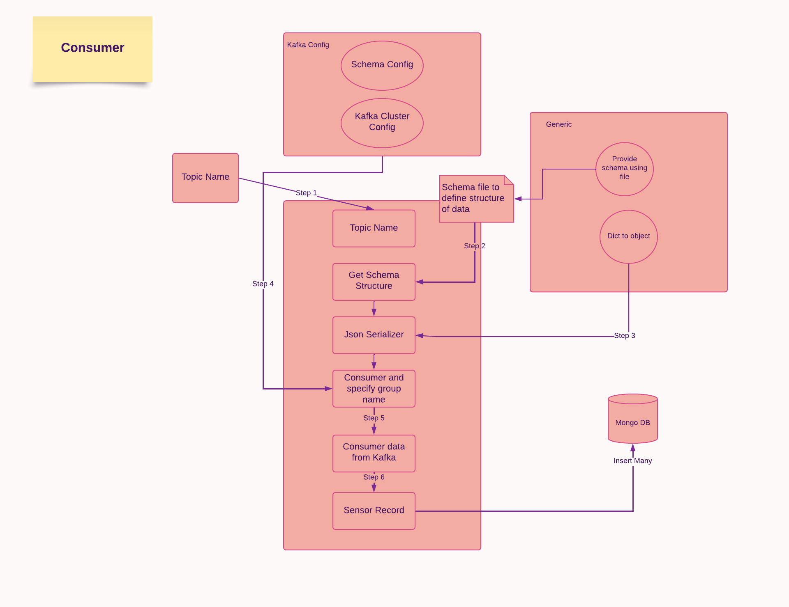

# Kafka Confluent Sensor Streaming Topic

This repo help us to know how to publish and consume data to and from kafka confluent in json format

## Producer - Flowchart


## Consumer - Flowchart



## Step 1: Create conda environment
```
conda create -p venv python==3.8 -y
```

## Step 2: Activate the conda environment
```
conda activate venv/
```

## Step 3: Install required packages
```
pip install -r requirements.txt
```

## Step 4: Get credentials from Confluent
- Create Cluster keys
- Create Topic with same name as folder in sample_data directory
- Create Schema keys

### Cluster Environment Variable
```
API_KEY
API_SECRET_KEY
BOOTSTRAP_SERVER
```

### Schema related Environment Variable
```
SCHEMA_REGISTRY_API_KEY
SCHEMA_REGISTRY_API_SECRET
ENDPOINT_SCHEMA_URL
```

## Step 5: Create mongodb database on MongoDB Atlas
database name - sensor

### Data base related Environment Variable
```
MONGO_DB_URL
```


## Step 6: Update the credential in .env file 

Create .env file in root dir of your project if it is not available
paste the below content and update the credentials
```
API_KEY=<API_KEY>
API_SECRET_KEY=<API_SECRET_KEY>
BOOTSTRAP_SERVER=<BOOTSTRAP_SERVER>
SCHEMA_REGISTRY_API_KEY=<SCHEMA_REGISTRY_API_KEY>
SCHEMA_REGISTRY_API_SECRET=<SCHEMA_REGISTRY_API_SECRET>
ENDPOINT_SCHEMA_URL=<ENDPOINT_SCHEMA_URL>
MONGO_DB_URL=<MONGO_DB_URL>
```

## Step 7: Build Docker image to run your application in docker container

### Build docker image
```
docker build -t sensor-streaming-pipeline:latest .
```

### Run docker image (For linux or mac)
```
docker run -it -v $(pwd)/logs:/logs  --env-file=$(pwd)/.env sensor-streaming-pipeline:latest
```

